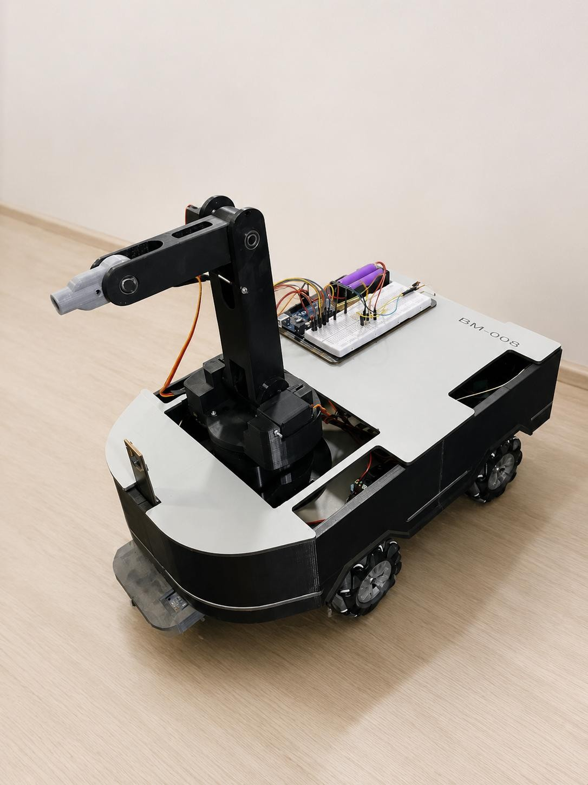
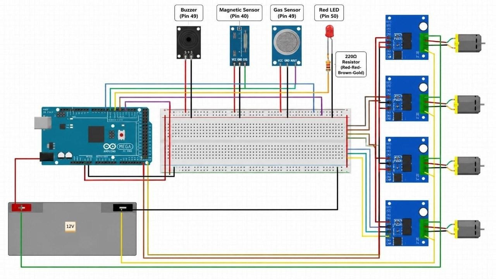
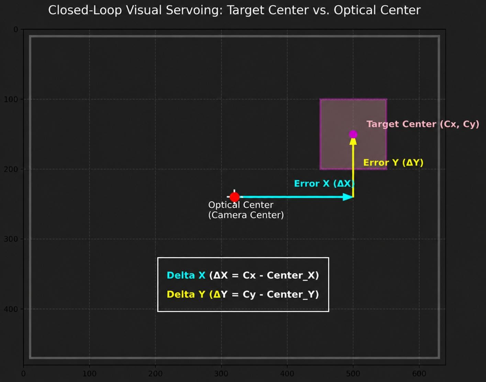
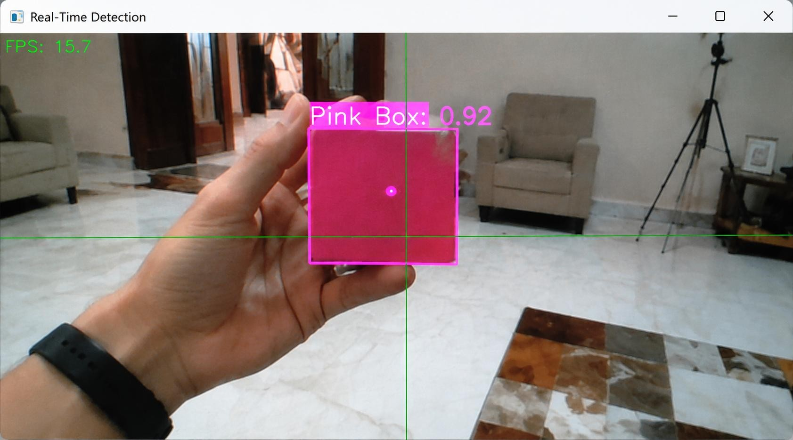
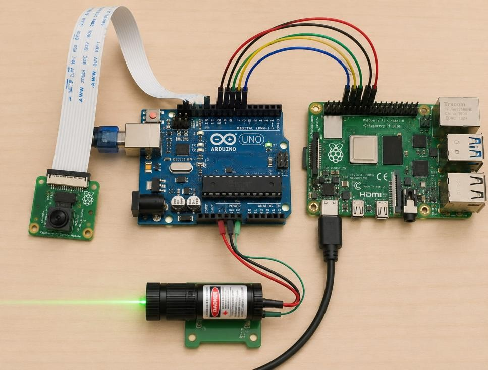

# Vision-Guided Target Tracking & Laser Pointing Robot

Graduation Project — Mechatronics, Robotics & Automation Engineering, Tanta University.

A mobile robot that detects a colored target with an onboard camera and points a laser at it by driving a 4-DOF robotic arm through closed-loop visual servoing. The current firmware actively drives 2 of the 4 axes (pan/tilt), holding the other two at a fixed neutral pose. The platform also carries gas and magnetic sensors for environment monitoring, and is built around a 4-wheel mecanum base for omnidirectional movement.



## System architecture

The system runs on three independent controllers:

| Module | Hardware | Role |
| --- | --- | --- |
| `raspberry_pi/` | Raspberry Pi 4 + IMX219 camera | Runs YOLO11n on NCNN, detects and verifies the target, computes the pixel error vector and streams it over UART |
| `robot_arm/` | Arduino + 4-DOF servo arm (2 actively driven for pan/tilt) + laser module | Receives the pixel error vector over serial, converts it into pan/tilt corrections, moves the servos gradually, drives the laser, and falls back to a safe pose on signal loss |
| `mobile_base/` | Arduino Mega + 4× DC motors (mecanum) | Bluetooth-driven mecanum platform with gas sensor, magnetic sensor, buzzer and LED alarms |

Data flow: camera → Raspberry Pi (detection, HSV verification, pixel error vector) → serial → arm controller (pixel error → pan/tilt correction → servos + laser).



## Detection pipeline (Raspberry Pi)

1. Capture a 640×480 BGR frame from the IMX219 through Picamera2.
2. Resize to 512×512, normalize, and run an NCNN forward pass on YOLO11n.
3. Decode the raw candidate tensor and filter by confidence threshold.
4. Apply IoU-based Non-Maximum Suppression to remove overlapping boxes.
5. Scale the surviving boxes back to the original frame resolution.
6. Run a second-stage HSV verification — any box with less than 15% pink pixels is rejected. This deterministic check eliminates false positives that pass the neural network.
7. Require the target in 3 consecutive frames before locking, which suppresses single-frame jitter.
8. Compute `error_x` and `error_y` relative to the frame center and transmit them.
9. On target loss, issue a `STOP` command to the actuators.

Run with:

```bash
python3 target_detection.py --conf 0.75
```

`model.ncnn.param` and `model.ncnn.bin` must be present in the working directory. Dependencies: `ncnn`, `opencv-python`, `numpy`, `pyserial`, `picamera2`.

## Arm controller

Parses `error_x,error_y` from serial — the pixel offset between the target's center and the camera's optical center, exactly as the Raspberry Pi computes it. A ±15-pixel deadband ignores noise, then the error is converted into a pan correction (base servo) and a tilt correction (shoulder servo), each clamped into servo range with `constrain()`. Corrections are applied gradually, one degree every 80 ms, without ever calling a blocking `delay()`, so serial reception is never starved. The elbow and wrist servos are held at a fixed neutral pose since only 2 axes (pan/tilt) are actively corrected.

A dedicated `STOP` message turns the laser off without snapping the arm back to center. A 2-second watchdog covers the case where the serial stream stops entirely: the arm holds its last position, and the laser switches off, until fresh data arrives.



Live detection, seen from the camera feed used to compute `error_x`/`error_y`:



## Mobile base

Mecanum drive with six motion primitives — forward, backward, strafe left/right, and rotate left/right — selected by single-character Bluetooth commands (`F`, `B`, `L`, `R`, `A`, `D`, `S`). The gas sensor drives both the buzzer and a status LED; the magnetic sensor drives the buzzer.

## Hardware

- Raspberry Pi 4
- IMX219 camera module
- Arduino Mega 2560 — mobile base
- Arduino — robot arm controller
- 4× DC motors with mecanum wheels
- 4× servo motors (2 actively driven for pan/tilt, 2 held at a fixed neutral pose)
- Laser module
- Gas sensor, magnetic sensor, buzzer, LED
- Bluetooth module



## Repository layout

```
.
├── raspberry_pi/
│   └── target_detection.py     # Vision pipeline and serial transmission
├── robot_arm/
│   └── robot_arm.ino           # 4-DOF servo arm (pan/tilt driven) + laser + watchdog
└── mobile_base/
    └── mobile_base.ino         # Mecanum drive + sensor alarms
```

Each `.ino` file sits in a folder matching its name so the Arduino IDE opens it directly.

Comments inside the Arduino sketches are in Arabic, as written during development.
